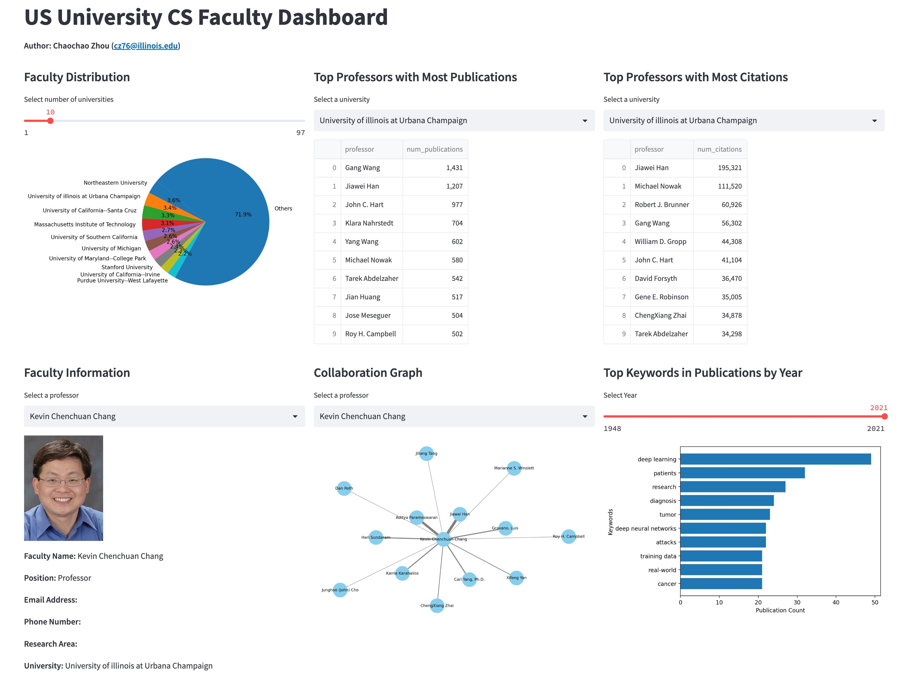
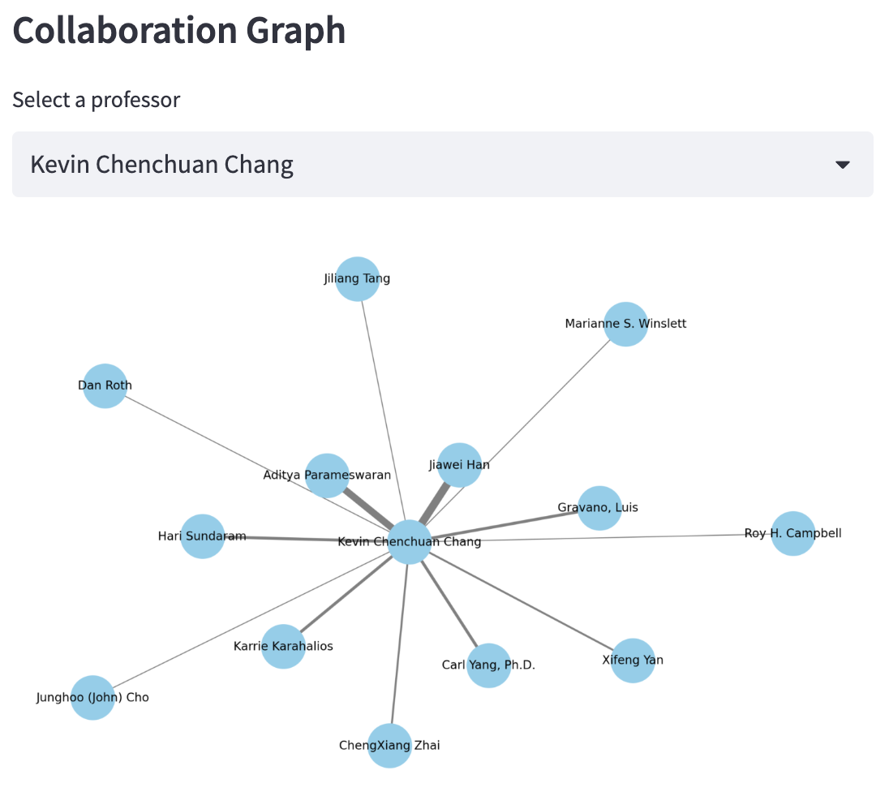

# FacultyExplorer: US University CS Faculty Dashboard
**Author: Chaochao Zhou (czhouphd@gmail.com)**

## Purpose
The application is used to explore US university CS faculty. The target users include any people who are interested in the academia of computer science in the US. The major objective is to explore research direction and resources in computer science.

## Video Demo. 
[Link to video demo](https://www.youtube.com/watch?v=LZWqZmyn4yA)

## Installation 
The dashboard was developed in Python 3.7.6 with required packages (also listed in `requirements.txt`):
- streamlit==1.23.1
- pandas==1.3.5
- matplotlib==3.5.3
- mysql-connector-python==8.0.33
- pymongo==4.7.3
- neo4j==5.23.0
- networkx==2.6.3

## Usage 
In Terminal, run the app by shell command: `streamlit run dashboard.py`

## Design 
As shown in the screenshot, the dashboard consists of Section 1 ~ 6 (left to right, top to bottom).
- Section 1: Faculty Distribution (MySQL)
- Section 2: Top Professors with Most Publications (MySQL)
- Section 3: Top Professors with Most Citations (MySQL)
- Section 4: Faculty Information (MySQL)
- Section 5: Collaboration Graph (Neo4j)
- Section 6: Top Keywords in Publications by Year (MongoDB)

## Implementation 
The dashboard was developed using `Streamlit 1.23.1`. In particular,
- Sections 1 ~ 4: MySQL queries
- Section 5: Neo4j query to obtain the collaborators (co-authors) of a specified professor, and the graph is presented using `NetworkX 2.6.3`
- Section 6: MongoDB query on the document of `publications.json`

## Database Techniques 
- Index the `year` and `keywords.name` fields of the MongoDB database (see `mongoIndex.sh`)
- Create a view named `sorted_faculty_names` for the MySQL database (see `myseqlView.sql`)
- Adopt a prepared statement for the MySQL database, which can be executed multiple times with different parameters efficiently (see the function `mysql_prepared_query()` in `utils.py`)
- Additionally, I implement multi-database querying. As shown in the screenshot of the section titled "Collaboration Graph" below, the selectbox for professors is populated by querying MySQL to provide a list of professors. The user-selected professor is then used in a Neo4j query to obtain the relationships between the professor and their collaborators.

